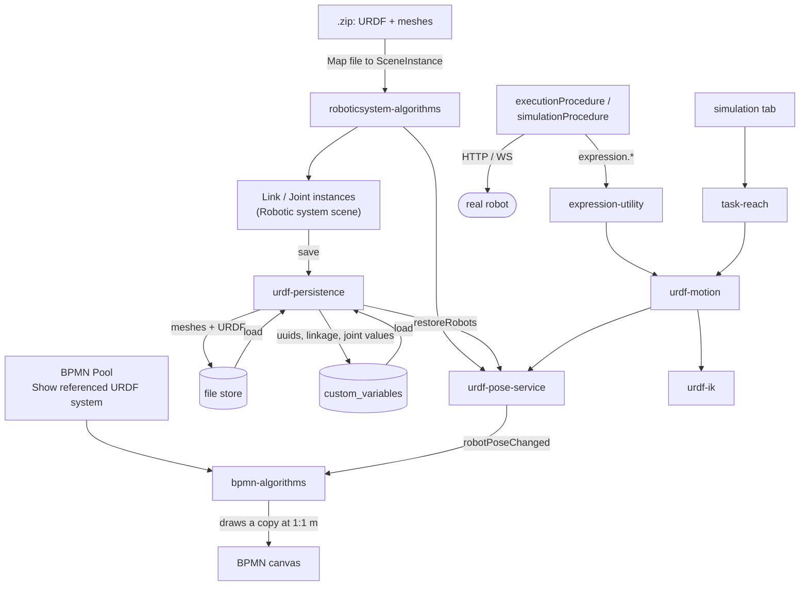

# Robotics: URDF robots, BPMN Pools, and executable actions

How a robot gets into a model, how it is drawn, driven and saved, and how a BPMN Task
becomes a command a machine can run.

This is the companion to [README.md](README.md), which covers the client as a whole. It
documents one feature set that spans several metamodels, two stored procedures and a
dozen modules — enough moving parts that "where do I change X?" is a fair question.

## Contents

- [The one convention that explains the rest](#the-one-convention-that-explains-the-rest)
- [Components](#components)
- [How the pieces interact](#how-the-pieces-interact)
- [What the metamodel must declare](#what-the-metamodel-must-declare)
- [How to specify an action](#how-to-specify-an-action)
- [Positions: frames and units](#positions-frames-and-units)
- [The two procedures](#the-two-procedures)
- [The simulation tab](#the-simulation-tab)
- [What is stored where](#what-is-stored-where)
- [Limits worth knowing](#limits-worth-knowing)

## The one convention that explains the rest

**One canvas unit is one metre.** A URDF import writes URDF coordinates straight into
`coordinates_2d` (`scaleFactor = 1` in `roboticsystem-algorithms`), and ObjectSpace sizes
a Detectable by its "size in meters" attribute. Everything here follows from that: a
robot is drawn life-size, a Pool's position is a place in the cell, and a Task's position
is somewhere a tool can be sent.

The consequence to expect: a real arm is small. A UFACTORY Lite6 is 0.30 × 0.13 × 0.44 m,
so in an 8 × 4 m Pool it looks like a speck — correctly. Size Pools like real cells
(2 × 1.5 m) rather than like diagram boxes.

## Components

| Module | What it owns |
| --- | --- |
| `engine/hybrid-algorithms/roboticsystem-algorithms.ts` | The URDF import: a `.zip` becomes Link and Joint instances with their attributes, poses and meshes. |
| `engine/hybrid-algorithms/urdf-persistence.ts` | What survives a save: meshes and the URDF go to the file store, references and linkage into `custom_variables`. Rebuilds both on load. |
| `engine/hybrid-algorithms/urdf-pose-service.ts` | The registry of parsed robots, and the only place that writes new poses onto Link/Joint instances. Publishes `robotPoseChanged`. |
| `engine/hybrid-algorithms/urdf-motion.ts` | Driving a robot from a command: joint values or a Cartesian target, with units. Chooses which robot. |
| `engine/hybrid-algorithms/urdf-ik.ts` | Cyclic-coordinate-descent inverse kinematics over a URDF chain, for Cartesian targets. |
| `engine/hybrid-algorithms/bpmn-algorithms.ts` | The Pool's robot: finding it, drawing it at true scale, keeping its copy in step. |
| `engine/hybrid-algorithms/task-reach.ts` | "Can the arm reach this Task?", and the canvas → robot-frame conversion. |
| `views/simulation-window/` | The simulation tab: joint sliders (robotic scene) and the reach check (BPMN scene). |
| `resources/services/expression-utility.ts` | The API stored procedures call. **Method names are a contract with the database.** |
| `views/attribute-window/PositionPanel.tsx` | Position, rotation and scale of the selected instance. |

Two stored procedures live in the metamodel, not in this repository:
`executionProcedure` and `simulationProcedure`. See [The two procedures](#the-two-procedures).

## How the pieces interact



The thing to hold on to: **`urdf-pose-service` is the single writer of robot poses.**
Sliders, Joint-Origin edits and an executing model all go through it, and everything that
draws a robot elsewhere listens to its `robotPoseChanged` event. Nothing polls.

## What the metamodel must declare

These are attributes you add to your own metamodel. How the name is matched differs per
attribute, and it matters:

| Matching | Applies to | So |
| --- | --- | --- |
| **Case and punctuation ignored, plus any suffix** | the base frame | `Base X`, `Base X (m)` and `base_x` are the same declaration |
| **Case and punctuation ignored** | `Motion effect` | `Motion Effect` and `motion_effect` are the same declaration; `Motion effect notes` is not |
| **Case-insensitive** | `Show referenced URDF system` | `show referenced urdf system` works; a reworded name does not |

| Where | Attribute | Read by | Meaning |
| --- | --- | --- | --- |
| Pool | `Show referenced URDF system` | uuid or name | While `"true"`, the referenced robot is drawn in the Pool. |
| Pool | `Target system entity` | uuid | Reference → the Configuration system. |
| Pool | Communication configuration | *shape* | Whichever reference carries a `protocol` attribute. |
| Configuration system | reference → Robotic system scene | *shape* | Whichever reference points at a scene. |
| Configuration system | `Base X` / `Base Y` / `Base Z` (m), `Base yaw` (deg) | name (loose) | Where in the Pool the arm's base stands, and its facing. Absent means the Pool's origin, facing 0. |
| Primitive configuration | `Motion effect` | name | `none \| joint-rad \| joint-deg \| cartesian-m \| cartesian-mm` — see below. |
| Primitive configuration | command schema | uuid | The command template variables are substituted into. |
| Task | Primitive configuration | uuid | Which action this step performs. |
| Task ↔ Pool | Message Flow relation | uuid | Which system the Task acts on. Either direction. |

Anything found "by shape" needs no uuid at all: a Communication configuration is
recognised by carrying a protocol, and a Configuration system by having a scene behind
it. Renaming those attributes will not break the walk.

## How to specify an action

An action is a **Primitive configuration**. A Task performs one; the Pool it flows to
says which machine, and how to talk to it.

**1. Declare the action.** Create a Primitive configuration with a command schema — the
JSON the controller expects, with `${variable}` placeholders — and set `Motion effect`:

| `Motion effect` | Use for | The URDF sync will |
| --- | --- | --- |
| `none` (default) | suction cup, gripper, enable, wait | leave the model alone |
| `joint-deg` | `set_servo_angle` and friends | apply the angles, converting degrees → radians |
| `joint-rad` | a controller that speaks radians | apply them as they are |
| `cartesian-mm` | `set_position`, `xarm_move_arc_line` | solve IK to the point, converting mm → m |
| `cartesian-m` | a controller that speaks metres | the same, without conversion |

The name is matched with case and punctuation normalised away, in both the client and the
procedures, so `Motion Effect` and `motion_effect` are the same declaration — a name that
merely *looks* right should not read as "no motion".

This flag is the **only** thing that decides whether a Task moves the model. Nothing
inspects the command text: "move to pick" and "suction cup on" are both commands with
numbers in them, and matching on the word "move" breaks on `MoveL` and on the first model
written in another language.

**2. Give the Task its values.** In the Task's variable table, each row is a name and a
value; values may contain `$$` references, resolved before substitution:

```
X = $$cmdx
Y = $$cmdy
Z = $$cmdz
speed = 100
```

**3. Wire the Task to a Pool** with a Message Flow. The Pool carries the Communication
configuration (protocol, address, port, path) and, through its Configuration system, the
robot.

**4. Run it** from the Algorithms dialog — `simulationProcedure` to watch it, or
`executionProcedure` to send it.

### The `$$` grammar, in brief

```
$$Name                      an attribute of THIS Task
$$Instance/Attr             an attribute of another instance
$${Instance Name / Attr}    the braced form, when a name has spaces or "/"
```

Instance selectors: omitted / `self` / `task` = the Task; `pool` = the Pool it flows to;
`target` = that Pool's Configuration system; `comm` = its Communication configuration;
`primitive` = the Task's Primitive; a uuid; or any instance name seen during the run.

Geometry keywords resolve against the instance rather than its attributes: `position`,
`x`, `y`, `z`, `rotation`, `qx…qw`, and the two that matter for movement:

| Keyword | Gives |
| --- | --- |
| `cmdpos`, `cmdx`, `cmdy`, `cmdz` | the canvas position **as the command** — units converted, nothing re-framed |
| `robotpos`, `robotx`, `roboty`, `robotz` | the same point expressed **relative to the arm's base** |

## Positions: frames and units

Three frames exist, and confusing them is the classic way to send an arm somewhere
surprising:

1. **The canvas** — metres, scene origin.
2. **The robot's base** — what a controller's Cartesian command is measured from.
3. **The controller's units** — often millimetres.

`$$cmdpos` converts only the units: the canvas coordinates *are* the command. Use it when
the model is laid over the real cell (AR), where the two spaces are the same space.

`$$robotpos` also re-expresses the point against the arm's base, using the Pool's
placement and the Configuration system's base frame. Use it when the model's origin is
not the robot's.

They agree exactly when the arm's base sits at the model's origin: Pool at (0, 0), base
zero, no yaw. **If you use `$$cmdpos`, that alignment is what makes the simulation tab's
reachability check agree with the machine** — that check always solves against the arm's
own base.

Units in the other direction — a command arriving at the model — are read from the same
`Motion effect`, so the two directions cannot drift apart.

## The two procedures

Both are stored in the metamodel and run from the Algorithms dialog. They are the **same
file** apart from one line:

```js
const MODE = "execute";   // or "simulate"
```

Everything above it is shared: the same graph, the same token semantics (waves, parallel
gateways, AND/OR joins), the same commands crafted from the same schemas. Only the ending
differs:

| | `execute` | `simulate` |
| --- | --- | --- |
| Command | sent over HTTP/WS | logged as `would send:` — no socket opened |
| Communication configuration | required | not needed; a model with no robot still runs |
| The model's robot | moved **after** the controller accepts | moved instead of sending |
| Motion | snaps (the real arm takes its own time) | animated over `MOTION_STEPS` |
| Pacing | none | dwells per Task, from its Waiting/Execution/Resting/Transport times × `TIME_SCALE` |

They are duplicates and can drift: there is no import mechanism between stored
procedures. **Fix a bug in one, port it to the other.**

## The simulation tab

What it shows depends on the open scene:

- **Robotic system scene** — one slider per Joint, driving `urdfPoseService`. Values are
  remembered (`custom_variables.urdf.jointValue`) so a reopened scene comes back in the
  pose you left it, not at the URDF's rest pose.
- **BPMN scene** — the **reach check**. Pick a Task, and the Pool's robot is posed as if
  reaching it; drag the Task around the canvas and the arm follows, reporting *In reach*
  or how far short it stopped. "Clear" puts the robot back where it was.

The reach check lists Tasks whose Pool is currently *showing* its robot — without a drawn
robot there is no frame to be relative to.

## What is stored where

A URDF import leaves things on the instances that are **not** gds fields, so the server
drops them. What survives a save:

| Thing | Where |
| --- | --- |
| Link meshes, the URDF source | the file store (`POST /metamodel/files`), uploaded **on save** so an unsaved import leaves no files |
| Mesh file uuid, format, scale | `class_instance.custom_variables.urdf.mesh` |
| Link/Joint linkage (`robotKey`, kind, name) | `class_instance.custom_variables.urdf` |
| Simulated joint value | `class_instance.custom_variables.urdf.jointValue` |
| Which robots a scene holds | `scene_instance.custom_variables.urdfRobots` |
| Instance scale | `custom_variables.scale` (written by `coordinates-updater`) |

`custom_variables` is a real column on every instance object; the engine-only properties
(`urdfVizRep`) are stripped from every payload by `omitEngineOnly` in `scene-diff`.

## Limits worth knowing

- **The IK is an illustration, not a prediction.** CCD finds *a* pose that reaches the
  point: no orientation, no elbow preference, no collision checking. Where a controller
  can report its own joint angles, feed those to `setRobotJoints` instead — that is the
  truthful sync.
- **A robot cannot report where it stands.** A controller knows joints and a TCP relative
  to its own base; the base pose in your cell is a human-declared deployment fact.
- **`robotKey` is the URDF's root link name**, not the robot's name (`robot.urdfName` on
  a `URDFRobot`, which extends `URDFLink`). Two robots whose URDFs both start at
  `base_link` collide in the registry.
- **A scene can list a robot it has no instances for** — an import that was replaced
  leaves its entry behind. Such a phantom is ignored at load, and a robot with no joints
  is never chosen to drive.
- **Deleting a Link clears the Joint references to it.** A reference attribute is a
  foreign key; one left pointing at a deleted instance makes the whole scene unsavable.
- **The Pool's robot is a copy**, drawn from the referenced scene's meshes. It carries no
  instance uuids, is never added to `dragObjects`, and opts out of raycasting — a click
  on it selects the Pool.
